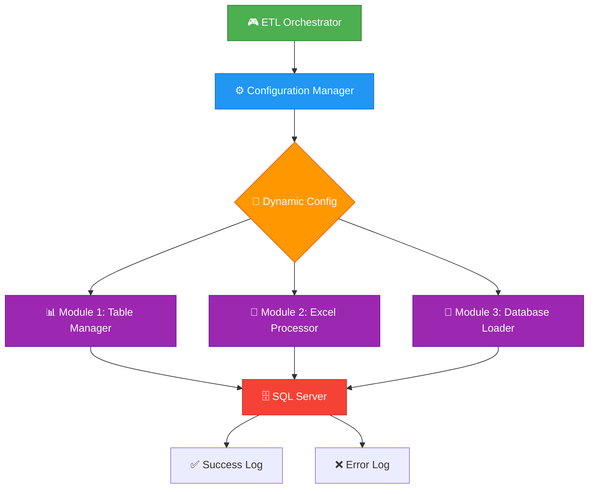

<div align="center">

# 🚀 Universal Excel Tool

### Enterprise-Grade ETL System for Excel to SQL Server

[](https://dotnet.microsoft.com/)
[](https://docs.microsoft.com/en-us/dotnet/csharp/)
[](https://www.microsoft.com/sql-server)
[](https://www.microsoft.com/windows)
[](https://opensource.org/licenses/MIT)

**Transform your Excel data management with automated, scalable, and intelligent ETL processing**

[🎯 Features](#-key-features) • [📦 Installation](#-installation) • [📖 Documentation](#-documentation) • [🤝 Contributing](#-contributing)

---

</div>

## 📋 Table of Contents

- [🎯 Key Features](#-key-features)
- [🏗️ Architecture](#️-architecture)
- [⚡ Quick Start](#-quick-start)
- [📦 Installation](#-installation)
- [⚙️ Configuration](#️-configuration)
- [💻 Usage](#-usage)
- [📂 Project Structure](#-project-structure)
- [🔧 Modules](#-modules)
- [🛠️ Development](#️-development)
- [❓ Troubleshooting](#-troubleshooting)
- [🤝 Contributing](#-contributing)
- [📄 License](#-license)

---

## 🎯 Key Features

<table>
<tr>
<td width="50%">

### 🎨 **Core Capabilities**

🔄 **Automated ETL Pipeline**  
Complete workflow from Excel to database

⚡ **Dynamic Table Configuration**  
Runtime table mapping with user input

🚀 **Parallel Excel Processing**  
Multi-threaded sheet extraction

🎯 **Smart Sheet Categorization**  
Keyword-based routing (SUP, DEM)

✅ **Column Validation**  
Pre-import schema matching

</td>
<td width="50%">

### 💪 **Technical Excellence**

📊 **Bulk Data Import**  
Optimized SqlBulkCopy (1M+ rows/batch)

📝 **Comprehensive Logging**  
Console, file, and database audit trails

🔄 **Error Recovery**  
Continue-on-error support

🖥️ **Modern Desktop UI**  
Avalonia-based interface

🛡️ **Production-Ready**  
Transaction safety, rollback support

</td>
</tr>
</table>

### ⚙️ **Why Choose Universal Excel Tool?**

```
✨ Self-Contained Deployment  →  No external runtime required
🌍 Location-Agnostic         →  Auto-detects root directory  
� Modular Architecture       →  Independent, reusable components
⚡ Performance Optimized      →  Handles millions of rows efficiently
� Enterprise-Ready           →  Battle-tested in production environments
```

---

## 🏗️ Architecture

<div align="center">



</div>

### 📋 **Workflow Pipeline**

<table>
<tr>
<td align="center" width="25%">

**1️⃣ Configure**  
🎯 Set table mappings  
✨ Interactive wizard  
🔧 Database validation

</td>
<td align="center" width="25%">

**2️⃣ Process**  
📊 Split Excel sheets  
🚀 Parallel processing  
🎨 Preserve formatting

</td>
<td align="center" width="25%">

**3️⃣ Import**  
💾 Load to SQL Server  
✅ Column validation  
⚡ Bulk operations

</td>
<td align="center" width="25%">

**4️⃣ Audit**  
📝 Comprehensive logs  
📊 Performance metrics  
🔍 Error tracking

</td>
</tr>
</table>

---

## ⚡ Quick Start

```powershell
# 1️⃣ Clone the repository
git clone https://github.com/yourusername/Universal_Excel_Tool.git
cd Universal_Excel_Tool

# 2️⃣ Build the solution
.\build_self_contained.bat

# 3️⃣ Configure your settings
# Edit appsettings.json with your database and paths

# 4️⃣ Run the ETL process
.\Core\bin\Release\net8.0\win-x64\UniversalExcelTool.exe
```

<div align="center">

**🎉 That's it! Your ETL pipeline is ready to process Excel files!**

</div>

---

## 📦 Installation

### 📋 **Prerequisites**

<table>
<tr>
<td width="33%">

#### 🖥️ **System**
- Windows 10/11
- Windows Server 2016+
- 4GB RAM (8GB+ recommended)
- 500MB disk space

</td>
<td width="33%">

#### ⚙️ **Runtime**
- .NET 8.0 SDK
- SQL Server 2016+
- Azure SQL Database
- Git (optional)

</td>
<td width="33%">

#### 🛠️ **Development**
- Visual Studio 2022
- VS Code + C# extension
- SQL Server Mgmt Studio
- Git for Windows

</td>
</tr>
</table>

### 🚀 **Installation Methods**

<details>
<summary><b>📥 Option 1: Download Pre-built Release (Recommended)</b></summary>

```powershell
# 1. Download the latest release
https://github.com/yourusername/Universal_Excel_Tool/releases

# 2. Extract to your desired location
Expand-Archive -Path Universal_Excel_Tool.zip -DestinationPath C:\Tools\

# 3. Update configuration
cd C:\Tools\Universal_Excel_Tool
notepad appsettings.json

# 4. Run the tool
.\Core\bin\Release\net8.0\win-x64\UniversalExcelTool.exe
```

</details>

<details>
<summary><b>🔨 Option 2: Build from Source</b></summary>

```powershell
# 1. Clone the repository
git clone https://github.com/yourusername/Universal_Excel_Tool.git
cd Universal_Excel_Tool

# 2. Restore dependencies
dotnet restore

# 3. Build (self-contained with runtime)
.\build_self_contained.bat

# Alternative: Build and run immediately
.\build_and_run.bat

# 4. Configure the application
notepad appsettings.json
```

</details>

<details>
<summary><b>🐳 Option 3: Docker (Coming Soon)</b></summary>

```bash
docker pull yourusername/universal-excel-tool:latest
docker run -v /data:/app/data universal-excel-tool
```

</details>

---

## ⚙️ Configuration

### 📝 **Main Configuration File**

<details>
<summary><b>🔧 appsettings.json - Click to expand</b></summary>

```json
{
  "Environment": {
    "RootDirectory": "F:\\Projects-Hub\\Universal_Excel_Tool",
    "Environment": "Production"  // Dev, Test, or Production
  },
  "Database": {
    "Server": "YOUR_SERVER\\INSTANCE",
    "Database": "RAW_PROCESS",
    "IntegratedSecurity": true,  // Use Windows Auth
    "ConnectionTimeout": 600      // 10 minutes
  },
  "Paths": {
    "InputExcelFiles": "E:\\Files",                      // 📥 Input: Source Excel files
    "OutputExcelFiles": "E:\\Files\\ExcelFiles",         // 📁 Output: Regular processed files
    "SpecialExcelFiles": "E:\\Files\\Special_Sheets",   // 📂 Output: Special categorized files (SUP, DEM)
    "LogFiles": "Logs",                                   // 📝 Logs: Application logs
    "TempFiles": "Temp"                                   // 🗂️ Temp: Temporary files
  },
  "Processing": {
    "BatchSize": 1000000,                             // 🚀 1M rows/batch
    "ValidateColumnMapping": true,                     // ✅ Enable validation
    "SpecialSheetKeywords": ["SUP", "DEM"]            // 🎯 Sheet routing
  },
  "Tables": {
    "ErrorTableName": "Error_table",                  // ❌ Error logging
    "SuccessLogTableName": "Success_table"            // ✅ Audit trail
  }
}
```

</details>

### 🎯 **Configuration Quick Reference**

| Setting | Description | Example | Required |
|---------|-------------|---------|----------|
| 🗄️ **Database.Server** | SQL Server instance | `localhost\\SQLEXPRESS` | ✅ Yes |
| 📊 **Database.Database** | Target database | `RAW_PROCESS` | ✅ Yes |
| 📥 **Paths.InputExcelFiles** | Input directory (source files) | `E:\\Files` | ✅ Yes |
| 📁 **Paths.OutputExcelFiles** | Output directory (processed) | `E:\\Files\\ExcelFiles` | ✅ Yes |
| 📂 **Paths.SpecialExcelFiles** | Special files (SUP, DEM) | `E:\\Files\\Special_Sheets` | ⚙️ Optional |
| 📦 **Processing.BatchSize** | Rows per batch | `1000000` | ⚙️ Optional |
| 🎯 **SpecialSheetKeywords** | Sheet categories | `["SUP", "DEM"]` | ⚙️ Optional |

---

## 💻 Usage

### 🎮 **Command Line Interface**

<table>
<tr>
<td width="50%">

#### 🚀 **Quick Commands**

```powershell
# Complete ETL pipeline
UniversalExcelTool.exe

# Skip table config (use existing)
UniversalExcelTool.exe --skip-dynamic-config

# Continue despite errors
UniversalExcelTool.exe --continue-on-error

# Show current configuration
UniversalExcelTool.exe --show-config

# Display help
UniversalExcelTool.exe --help
```

</td>
<td width="50%">

#### 🎯 **Module-Specific**

```powershell
# Only table configuration
UniversalExcelTool.exe --dynamic-table-only

# Only Excel processing
UniversalExcelTool.exe --excel-only

# Only database import
UniversalExcelTool.exe --database-only

# Update root directory
UniversalExcelTool.exe --root-directory "C:\Path"
```

</td>
</tr>
</table>

### 🎨 **Desktop UI (Modern Interface)**

<div align="center">

```powershell
# Launch Avalonia Desktop Application
.\UniversalExcelTool.UI\bin\Release\net8.0\win-x64\UniversalExcelTool.UI.exe

# Or create a desktop shortcut
.\UniversalExcelTool.UI\create_desktop_shortcut.ps1
```

**🖥️ Features:** Real-time monitoring • Visual configuration • Progress tracking • Interactive dashboard • Live log viewer

</div>

#### 🌟 **UI Application Highlights**

<table>
<tr>
<td align="center" width="25%">

**📊 Dashboard**  
System status cards  
Quick action buttons  
Real-time metrics

</td>
<td align="center" width="25%">

**⚙️ Configuration**  
Step-by-step wizards  
Database validation  
Visual table setup

</td>
<td align="center" width="25%">

**📈 Monitoring**  
Live progress bars  
Performance stats  
Time estimates

</td>
<td align="center" width="25%">

**📝 Logging**  
Color-coded entries  
Filter by severity  
Export capabilities

</td>
</tr>
</table>

**UI Framework:** Avalonia 11.0.6 | **Architecture:** MVVM Pattern | **Status:** ✅ Production Ready

### 📦 **Individual Modules**

```powershell
# 1️⃣ Configure table mappings (Interactive)
.\ETL_DynamicTableManager\bin\Release\net8.0\win-x64\ETL_DynamicTableManager.exe

# 2️⃣ Process Excel files (Automated)
.\ETL_Excel\bin\Release\net8.0\win-x64\ETL_Excel.exe --non-interactive

# 3️⃣ Import to database (Automated)
.\ETL_ExcelToDatabase\bin\Release\net8.0\win-x64\ETL_ExcelToDatabase.exe
```

---

## 📂 Project Structure

```
Universal_Excel_Tool/
├── Core/                           # Orchestrator & configuration
│   ├── Program.cs                  # Entry point
│   ├── ETLOrchestrator.cs          # Module coordinator
│   └── UnifiedConfigurationManager.cs
│
├── ETL_DynamicTableManager/        # Interactive table config
│   ├── Program.cs
│   ├── Services/
│   │   ├── TableConfigurationService.cs
│   │   └── UserInputService.cs
│   └── Core/DatabaseOperations.cs
│
├── ETL_Excel/                      # Excel processor
│   ├── Program.cs
│   └── Modules/
│       ├── ExcelProcessor.cs       # Sheet splitting logic
│       ├── FileManager.cs
│       └── ConfigurationManager.cs
│
├── ETL_ExcelToDatabase/            # Database loader
│   ├── Program.cs
│   ├── Core/DatabaseOperations.cs  # Bulk import
│   └── Services/
│       ├── ValidationService.cs
│       └── LoggingService.cs
│
├── UniversalExcelTool.UI/          # Avalonia desktop app
│   ├── ViewModels/
│   ├── Views/
│   └── Services/
│
├── appsettings.json                # Main configuration
├── dynamic_table_config.json       # Runtime config
├── .gitignore
└── README.md
```

---

## 🔧 Modules

<table>
<tr>
<td align="center" width="20%">

### 🎮
**Orchestrator**

Centralized ETL control center

[Details →](#orchestrator-details)

</td>
<td align="center" width="20%">

### ⚙️
**Table Manager**

Interactive config wizard

[Details →](#table-manager-details)

</td>
<td align="center" width="20%">

### 📊
**Excel Processor**

Multi-sheet splitter

[Details →](#excel-processor-details)

</td>
<td align="center" width="20%">

### 💾
**DB Loader**

Bulk data import

[Details →](#database-loader-details)

</td>
<td align="center" width="20%">

### 🖥️
**Desktop UI**

Visual interface

[Details →](#desktop-ui-details)

</td>
</tr>
</table>

<details id="orchestrator-details">
<summary><b>🎮 1. ETL Orchestrator (Core/)</b></summary>

**Purpose:** Centralized command center for ETL pipeline

✅ Loads unified configuration  
✅ Executes modules sequentially  
✅ Handles errors and logging  
✅ Provides CLI interface  

**Key Files:**
- `Program.cs` - Entry point
- `ETLOrchestrator.cs` - Module coordinator
- `UnifiedConfigurationManager.cs` - Config handler

</details>

<details id="table-manager-details">
<summary><b>⚙️ 2. Dynamic Table Manager</b></summary>

**Purpose:** Interactive table configuration wizard

✅ Prompts for temp/destination table names  
✅ Validates database connectivity  
✅ Checks table existence  
✅ Saves configuration for other modules  

**Workflow:**
1. User selects temp table name
2. Choose existing or create new target
3. Validate against SQL Server
4. Save to `dynamic_table_config.json`

</details>

<details id="excel-processor-details">
<summary><b>📊 3. Excel Processor</b></summary>

**Purpose:** Split multi-sheet workbooks

✅ Parallel sheet processing  
✅ Keyword-based categorization (SUP, DEM)  
✅ Formula and formatting preservation  
✅ Individual Excel files per sheet  

**Features:**
- Multi-threaded processing
- Sheet categorization
- Format preservation
- Progress tracking

</details>

<details id="database-loader-details">
<summary><b>💾 4. Database Loader</b></summary>

**Purpose:** Bulk import with validation

✅ Three-phase import (Staging → Validation → Transfer)  
✅ Column mapping validation  
✅ SqlBulkCopy optimization (1M+ rows/batch)  
✅ Comprehensive error logging  

**Import Strategy:**
```
📥 Stage → ✅ Validate → 💾 Transfer → 📝 Log
```

</details>

<details id="desktop-ui-details">
<summary><b>🖥️ 5. Desktop UI Application (Avalonia)</b></summary>

**Purpose:** Modern cross-platform desktop interface with visual workflow management

#### ✨ **Key Features**

**Architecture:**
- 🏗️ **MVVM Pattern** - Clean separation of concerns
- 🎨 **Avalonia UI 11.0.6** - Modern, responsive framework
- 🔄 **Reactive Design** - Real-time updates and notifications
- 📱 **Cross-Platform Ready** - Windows, Linux, macOS support

**User Interface Components:**

1. **📊 Dashboard View**
   - System status overview cards
   - Database connection status
   - Quick action buttons
   - Live execution logs with color coding
   - Performance metrics display

2. **⚙️ Dynamic Table Configuration View**
   - Interactive step-by-step wizard
   - Database connectivity testing
   - Table existence validation
   - Configuration preview and confirmation
   - Save/load configuration profiles

3. **📁 Excel Processor View**
   - File selection and preview
   - Processing progress indicators
   - Sheet categorization display
   - Real-time status updates
   - Performance statistics

4. **💾 Database Loader View**
   - Import progress tracking
   - Column validation results
   - Row count and performance metrics
   - Error/success logging
   - Batch processing status

**Technical Implementation:**

```
ViewModels/
├── MainWindowViewModel.cs       # Navigation & layout
├── DashboardViewModel.cs        # Overview & orchestration
├── DynamicTableConfigViewModel.cs  # Table configuration wizard
├── ExcelProcessorViewModel.cs   # Excel processing control
└── DatabaseLoaderViewModel.cs   # Database import management

Services/
├── IUILogger.cs                 # Logging abstraction
├── IProgressReporter.cs         # Progress tracking
├── INavigationService.cs        # View navigation
└── AvaloniaLogger.cs           # UI-specific logger
```

**Advantages over Console:**
- ✅ Better visual feedback during long operations
- ✅ Easier configuration management with forms
- ✅ Real-time progress monitoring with charts
- ✅ More intuitive for non-technical users
- ✅ Better error visualization and troubleshooting
- ✅ Execution history tracking
- ✅ Professional appearance for demonstrations

**Current Status:**
- ✅ **Phase 1:** Project structure & dependencies - COMPLETE
- ✅ **Phase 2:** MVVM infrastructure & UI views - COMPLETE
- ✅ **Phase 3:** Business logic integration - COMPLETE
- ✅ **Phase 4:** Production ready - DEPLOYED

**🎉 Desktop Application Status: PRODUCTION READY**

**Running the Desktop App:**

```powershell
# Build the UI project
cd UniversalExcelTool.UI
dotnet build -c Release

# Run the application
.\bin\Release\net8.0\win-x64\UniversalExcelTool.UI.exe

# Or build self-contained
.\build_self_contained.ps1
```

**Configuration:**
- Uses same `appsettings.json` as console application
- No additional configuration required
- Automatically detects root directory
- Shares all Core business logic

</details>

---

## 🛠️ Development

### Building the Solution

```bash
# Debug build
dotnet build

# Release build
dotnet build -c Release

# Self-contained (includes runtime)
dotnet publish -c Release -r win-x64 --self-contained true
```

### Running Tests

```bash
# Run all tests
dotnet test

# With coverage
dotnet test /p:CollectCoverage=true
```

### Adding New Modules

1. Create new .NET 8.0 console/library project
2. Reference `Core/UnifiedConfigurationManager.cs`
3. Add module info to `appsettings.json`:
   ```json
   "ExecutableModules": {
     "YourModule": {
       "RelativePath": "YourModule\\bin\\Release\\...",
       "Name": "Your Module Name",
       "Order": 4
     }
   }
   ```

---

## ❓ Troubleshooting

### 🔍 **Common Issues & Solutions**

<details>
<summary><b>❌ Database Connection Failed</b></summary>

**Symptoms:** Cannot connect to SQL Server

**Solutions:**
```powershell
# ✅ Verify SQL Server is running
Get-Service MSSQL*

# ✅ Test connection
sqlcmd -S YOUR_SERVER\INSTANCE -Q "SELECT @@VERSION"

# ✅ Check configuration
UniversalExcelTool.exe --show-config
```

**Checklist:**
- [ ] SQL Server service running
- [ ] Server name correct in `appsettings.json`
- [ ] Windows Authentication enabled OR credentials valid
- [ ] Firewall allows SQL Server connections

</details>

<details>
<summary><b>📁 Excel Files Not Found</b></summary>

**Symptoms:** No files to process message

**Solutions:**
- ✅ Check `Paths.InputExcelFiles` in configuration
- ✅ Ensure directory exists
- ✅ Verify file extensions (`.xlsx`, `.xls`)
- ✅ Check file permissions

```powershell
# List Excel files in directory
Get-ChildItem "E:\Files" -Filter *.xlsx
```

</details>

<details>
<summary><b>⚠️ Column Validation Errors</b></summary>

**Symptoms:** Data not imported, validation fails

**Solutions:**
1. Check `Error_table` in SQL Server for details
2. Review validation report in `Logs/` directory
3. Ensure Excel headers match database columns
4. Verify column names don't have special characters

**Query error logs:**
```sql
SELECT TOP 100 * FROM Error_table 
ORDER BY Timestamp DESC
```

</details>

<details>
<summary><b>🔧 Module Not Found</b></summary>

**Symptoms:** Cannot find executable

**Solutions:**
```powershell
# Build the solution
.\build_self_contained.bat

# Check if files exist
Test-Path ".\Core\bin\Release\net8.0\win-x64\UniversalExcelTool.exe"

# Use Debug build if Release unavailable
.\Core\bin\Debug\net8.0\win-x64\UniversalExcelTool.exe
```

</details>

### 📝 **Log Files Location**

| Log Type | Location | Purpose |
|----------|----------|---------|
| 🎮 **Orchestrator** | `Logs/ETL_Orchestrator_*.txt` | Overall process logs |
| 📺 **Console Output** | `Logs/Console_output_log_*.txt` | Full console capture |
| ❌ **Database Errors** | SQL: `Error_table` | Validation/import errors |
| ✅ **Success Audit** | SQL: `Success_table` | Completed operations |

### 🆘 **Getting Help**

```
📧 Issues: https://github.com/yourusername/Universal_Excel_Tool/issues
📖 Wiki: https://github.com/yourusername/Universal_Excel_Tool/wiki
💬 Discussions: https://github.com/yourusername/Universal_Excel_Tool/discussions
```

---

## 🤝 Contributing

<div align="center">

### 🌟 **We Welcome Contributions!**

[](http://makeapullrequest.com)
[](https://github.com/yourusername/Universal_Excel_Tool/graphs/contributors)

</div>

### 🚀 **How to Contribute**


<table>
<tr>
<td>

**1️⃣ Fork & Clone**
```bash
git clone https://github.com/your-username/Universal_Excel_Tool.git
cd Universal_Excel_Tool
```

</td>
<td>

**2️⃣ Create Branch**
```bash
git checkout -b feature/amazing-feature
```

</td>
<td>

**3️⃣ Make Changes**
```bash
# Code your feature
# Add tests
# Update docs
```

</td>
<td>

**4️⃣ Submit PR**
```bash
git push origin feature/amazing-feature
```

</td>
</tr>
</table>

### 📋 **Contribution Guidelines**

- ✅ Follow C# naming conventions
- ✅ Add XML documentation for public APIs
- ✅ Include unit tests for new features
- ✅ Update README for significant changes
- ✅ Keep commits atomic and well-described
- ✅ Ensure all tests pass before submitting

### 🏆 **Contributors**

<div align="center">

Thanks to all the amazing contributors!

<!-- Add contributor avatars here -->

</div>

---

## 📄 License

<div align="center">

**MIT License** © 2025 Universal Excel Tool

[](https://opensource.org/licenses/MIT)

This project is licensed under the MIT License - see the [LICENSE](LICENSE) file for details.

</div>

---

## 📞 Support & Community

<div align="center">

<table>
<tr>
<td align="center">

### 🐛 **Report Bug**
[Create Issue](https://github.com/yourusername/Universal_Excel_Tool/issues)

</td>
<td align="center">

### 💡 **Request Feature**
[Feature Request](https://github.com/yourusername/Universal_Excel_Tool/issues/new)

</td>
<td align="center">

### 💬 **Discussions**
[Join Chat](https://github.com/yourusername/Universal_Excel_Tool/discussions)

</td>
<td align="center">

### 📖 **Documentation**
[Read Docs](./DEPLOYMENT_README.md)

</td>
</tr>
</table>

</div>

---

## 🎉 Acknowledgments

<div align="center">

**Built with amazing technologies:**

[](https://dotnet.microsoft.com/)
[](https://docs.microsoft.com/en-us/dotnet/csharp/)
[](https://www.microsoft.com/sql-server)

**Special thanks to:**
- 📊 **ClosedXML** - Excel file manipulation
- 🎨 **Avalonia UI** - Cross-platform desktop framework
- 🗄️ **Microsoft SQL Server** - Database engine
- 🔧 **Community** - Open source contributors

</div>

---

<div align="center">

### ⭐ **If you find this project useful, please give it a star!** ⭐

**Made with ❤️ for efficient data processing**

[](https://github.com/yourusername/Universal_Excel_Tool/stargazers)

---

📅 *Last Updated: October 24, 2025* | 🚀 *Version 2.0.0* | 📝 *Status: Production Ready* | ✅ *All Modules Complete*

</div>
