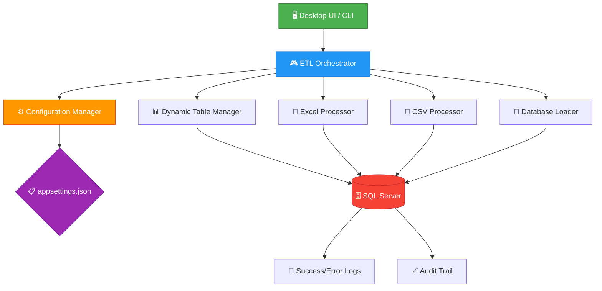

<div align="center">

# 🚀 Universal Excel Tool

### Enterprise-Grade ETL System for Excel & CSV to SQL Server

[](https://dotnet.microsoft.com/)
[](https://docs.microsoft.com/en-us/dotnet/csharp/)
[](https://www.microsoft.com/sql-server)
[](https://avaloniaui.net/)
[](https://www.microsoft.com/windows)
[](https://opensource.org/licenses/MIT)

**Transform your data management with automated, scalable, and intelligent ETL processing**

[🎯 Features](#-key-features) • [⚡ Quick Start](#-quick-start) • [📖 Documentation](#-documentation) • [🤝 Contributing](#-contributing)

---

</div>

## 📋 Table of Contents

- [🎯 Key Features](#-key-features)
- [🏗️ Architecture](#️-architecture)
- [⚡ Quick Start](#-quick-start)
- [📦 Installation](#-installation)
- [⚙️ Configuration](#️-configuration)
- [💻 Usage](#-usage)
- [📂 Project Structure](#-project-structure)
- [🔧 Modules](#-modules)
- [🛠️ Development](#️-development)
- [❓ Troubleshooting](#-troubleshooting)
- [🤝 Contributing](#-contributing)
- [📄 License](#-license)

---

## 🎯 Key Features

<table>
<tr>
<td width="50%">

### 🎨 **Core Capabilities**

🔄 **Unified ETL Pipeline**  
Complete workflow from Excel/CSV to database

⚡ **Dynamic Table Configuration**  
Runtime table mapping with user input

🚀 **Parallel Processing**  
Multi-threaded sheet extraction & data loading

📊 **Dual Format Support**  
Excel (.xlsx, .xls) and CSV processing

🎯 **Smart Sheet Categorization**  
Keyword-based routing (SUP, DEM)

✅ **Column Validation**  
Pre-import schema matching & verification

</td>
<td width="50%">

### 💪 **Technical Excellence**

📊 **Bulk Data Import**  
Optimized SqlBulkCopy (1M+ rows/batch)

📝 **Comprehensive Logging**  
Console, file, and database audit trails

🔄 **Error Recovery**  
Continue-on-error support with detailed tracking

🖥️ **Modern Desktop UI**  
Avalonia-based cross-platform interface

🛡️ **Production-Ready**  
Transaction safety with automatic rollback

🎯 **Location-Agnostic**  
Auto-detects root directory from config

</td>
</tr>
</table>

### ⚙️ **Why Choose Universal Excel Tool?**

```
✨ Self-Contained Deployment  →  No external runtime dependencies required
🌍 Environment-Agnostic       →  Works across development, test, and production  
🧩 Modular Architecture       →  Independent, reusable components
⚡ Performance Optimized      →  Handles millions of rows efficiently
🏢 Enterprise-Ready           →  Battle-tested in production environments
📱 Desktop & CLI Interfaces   →  Choose your preferred interaction mode
🔒 Secure Configuration       →  Centralized appsettings.json management
```

---

## 🏗️ Architecture

<div align="center">



</div>

### 📋 **Workflow Pipeline**

<table>
<tr>
<td align="center" width="20%">

**1️⃣ Configure**  
🎯 Set table mappings  
✨ Interactive wizard  
🔧 Database validation

</td>
<td align="center" width="20%">

**2️⃣ Extract**  
📊 Read Excel sheets  
📄 Parse CSV files  
🚀 Parallel processing

</td>
<td align="center" width="20%">

**3️⃣ Transform**  
🎨 Split by keywords  
🔄 Normalize data  
✅ Validate schemas

</td>
<td align="center" width="20%">

**4️⃣ Load**  
💾 Bulk insert data  
⚡ Transaction safety  
🔒 Error handling

</td>
<td align="center" width="20%">

**5️⃣ Audit**  
📝 Log everything  
📊 Track metrics  
🔍 Error reporting

</td>
</tr>
</table>

---

## ⚡ Quick Start

### 🖥️ **Option 1: Desktop Application (Recommended for New Users)**

```powershell
# 1️⃣ Build the application
.\Build_All_Release.bat

# 2️⃣ Configure your settings
notepad appsettings.json

# 3️⃣ Launch the desktop UI
.\UniversalExcelTool.UI.bat
```

### 💻 **Option 2: Command Line**

```powershell
# 1️⃣ Build all modules
.\Build_All_Release.bat

# 2️⃣ Configure your settings
notepad appsettings.json

# 3️⃣ Run Excel workflow
.\ETL_Excel_Orchestrator.bat

# Or CSV workflow
.\ETL_CSV_Orchestrator.bat
```

<div align="center">

**🎉 That's it! Your ETL pipeline is ready to process data!**

</div>

---

## 📦 Installation

### 📋 **Prerequisites**

<table>
<tr>
<td width="33%">

#### 🖥️ **System**
- Windows 10/11 or Server 2016+
- 4GB RAM (8GB+ recommended)
- 500MB disk space minimum
- Administrator rights for SQL

</td>
<td width="33%">

#### ⚙️ **Runtime**
- .NET 8.0 SDK
- SQL Server 2016+ or Azure SQL
- Windows x64 architecture
- Git (optional)

</td>
<td width="33%">

#### 🛠️ **Development**
- Visual Studio 2022 or VS Code
- C# Dev Kit extension
- SQL Server Management Studio
- PowerShell 5.1+

</td>
</tr>
</table>

### 🚀 **Installation Methods**

<details>
<summary><b>📥 Option 1: Clone Repository (Recommended)</b></summary>

```powershell
# 1. Clone the repository
git clone https://github.com/yourusername/Universal_Excel_Tool.git
cd Universal_Excel_Tool

# 2. Build all modules in Release mode
.\Build_All_Release.bat

# 3. Configure application settings
notepad appsettings.json
# Update: Database.Server, Database.Database, Paths

# 4. Run the application
.\UniversalExcelTool.UI.bat  # Desktop UI
# OR
.\ETL_Excel_Orchestrator.bat  # Excel workflow CLI
```

</details>

<details>
<summary><b>🔨 Option 2: Self-Contained Deployment</b></summary>

```powershell
# 1. Clone and navigate
git clone https://github.com/yourusername/Universal_Excel_Tool.git
cd Universal_Excel_Tool

# 2. Build self-contained (includes .NET runtime)
.\Build_All_SelfContained.bat

# 3. Configure settings
notepad appsettings.json

# 4. Deploy entire folder to target machine
# No .NET installation required on target!
```

**Benefits:**
- ✅ No .NET runtime needed on deployment machine
- ✅ Consistent runtime version across environments
- ✅ Simplified deployment and distribution
- ⚠️ Larger file size (~70-100MB per executable)

</details>

<details>
<summary><b>📦 Option 3: Individual Module Build</b></summary>

```powershell
# Build specific modules only
cd Core
dotnet build -c Release

cd ..\ETL_DynamicTableManager
dotnet build -c Release

cd ..\ETL_Excel
dotnet build -c Release

cd ..\ETL_ExcelToDatabase
dotnet build -c Release

cd ..\ETL_CsvToDatabase
dotnet build -c Release

cd ..\UniversalExcelTool.UI
dotnet build -c Release
```

</details>

---

## ⚙️ Configuration

### 📝 **Main Configuration File: appsettings.json**

The entire application is configured through a single centralized configuration file located in the root directory.

<details>
<summary><b>🔧 Complete Configuration Structure - Click to expand</b></summary>

```json
{
  "Environment": {
    "RootDirectory": "AUTO_DETECT",
    "Environment": "Production"
  },
  "Database": {
    "Server": "YOUR_SERVER\\INSTANCE",
    "Database": "YOUR_DATABASE",
    "IntegratedSecurity": true,
    "Username": "",
    "Password": "",
    "ConnectionTimeout": 600,
    "CommandTimeout": 0
  },
  "Paths": {
    "InputExcelFiles": "YOUR_INPUT_PATH",
    "InputCsvFiles": "YOUR_CSV_PATH",
    "OutputExcelFiles": "YOUR_OUTPUT_PATH",
    "SpecialExcelFiles": "YOUR_SPECIAL_PATH",
    "LogFiles": "Logs",
    "TempFiles": "Temp"
  },
  "ExecutableModules": {
    "DynamicTableManager": {
      "RelativePath": "ETL_DynamicTableManager\\bin\\Release\\net8.0\\win-x64\\ETL_DynamicTableManager.exe",
      "Name": "Dynamic Table Manager",
      "Description": "Configures dynamic table names for ETL process",
      "Order": 1,
      "Arguments": ""
    },
    "ExcelProcessor": {
      "RelativePath": "ETL_Excel\\bin\\Release\\net8.0\\win-x64\\ETL_Excel.exe",
      "Name": "Excel Processor",
      "Description": "Processes and splits Excel files",
      "Order": 2,
      "Arguments": "--non-interactive"
    },
    "DatabaseLoader": {
      "RelativePath": "ETL_ExcelToDatabase\\bin\\Release\\net8.0\\win-x64\\ETL_ExcelToDatabase.exe",
      "Name": "Database Loader",
      "Description": "Loads processed data into database",
      "Order": 3,
      "Arguments": ""
    },
    "CsvToDatabase": {
      "RelativePath": "ETL_CsvToDatabase\\bin\\Release\\net8.0\\win-x64\\ETL_CsvToDatabase.exe",
      "Name": "CSV to Database",
      "Description": "Loads CSV files directly into database",
      "Order": 4,
      "Arguments": ""
    }
  },
  "Processing": {
    "BatchSize": 1000000,
    "ValidateColumnMapping": true,
    "DefaultSheetName": "Sheet1",
    "SpecialSheetKeywords": ["SUP", "DEM"]
  },
  "Logging": {
    "Level": "Information",
    "EnableFileLogging": true,
    "EnableConsoleLogging": true,
    "LogRetentionDays": 30,
    "MaxLogFileSizeMB": 100
  },
  "Tables": {
    "ErrorTableName": "Error_table",
    "SuccessLogTableName": "Success_table",
    "AutoCreateLogTables": true
  },
  "Notifications": {
    "Csv": {
      "EnableProgressNotifications": true,
      "ProgressNotificationInterval": 50000
    },
    "Excel": {
      "EnableProgressNotifications": true,
      "ProgressNotificationInterval": 50000
    }
  }
}
```

</details>

### 🎯 **Configuration Quick Reference**

| Section | Setting | Description | Required | Default/Example |
|---------|---------|-------------|----------|-----------------|
| **Environment** | `RootDirectory` | Project root (auto-detected if not set) | ⚙️ Optional | `AUTO_DETECT` |
| | `Environment` | Runtime environment | ⚙️ Optional | `Production` |
| **Database** | `Server` | SQL Server instance name | ✅ Yes | `localhost\\SQLEXPRESS` |
| | `Database` | Target database name | ✅ Yes | `RAW_PROCESS` |
| | `IntegratedSecurity` | Use Windows Authentication | ✅ Yes | `true` |
| | `Username` | SQL auth username (if not integrated) | ⚙️ Optional | `""` |
| | `Password` | SQL auth password (if not integrated) | ⚙️ Optional | `""` |
| | `ConnectionTimeout` | Connection timeout (seconds) | ⚙️ Optional | `600` |
| **Paths** | `InputExcelFiles` | Source Excel files directory | ✅ Yes | Absolute or relative path |
| | `InputCsvFiles` | Source CSV files directory | ✅ Yes | Absolute or relative path |
| | `OutputExcelFiles` | Processed Excel output | ✅ Yes | Absolute or relative path |
| | `SpecialExcelFiles` | Categorized sheets output | ⚙️ Optional | Absolute or relative path |
| | `LogFiles` | Application logs directory | ⚙️ Optional | `Logs` (relative) |
| | `TempFiles` | Temporary files directory | ⚙️ Optional | `Temp` (relative) |
| **Processing** | `BatchSize` | Rows per bulk insert | ⚙️ Optional | `1000000` |
| | `ValidateColumnMapping` | Enable schema validation | ⚙️ Optional | `true` |
| | `SpecialSheetKeywords` | Sheet categorization keywords | ⚙️ Optional | `["SUP", "DEM"]` |
| **Logging** | `Level` | Log verbosity | ⚙️ Optional | `Information` |
| | `EnableFileLogging` | Write logs to files | ⚙️ Optional | `true` |
| | `LogRetentionDays` | Auto-cleanup old logs | ⚙️ Optional | `30` |
| **Tables** | `ErrorTableName` | Error logging table | ✅ Yes | `Error_table` |
| | `SuccessLogTableName` | Success audit table | ✅ Yes | `Success_table` |
| | `AutoCreateLogTables` | Create log tables if missing | ⚙️ Optional | `true` |
| **Notifications.Csv** | `EnableProgressNotifications` | Show progress updates for CSV | ⚙️ Optional | `true` |
| | `ProgressNotificationInterval` | Rows between progress updates | ⚙️ Optional | `50000` |
| **Notifications.Excel** | `EnableProgressNotifications` | Show progress updates for Excel | ⚙️ Optional | `true` |
| | `ProgressNotificationInterval` | Rows between progress updates | ⚙️ Optional | `50000` |

### 🔒 **Configuration Best Practices**

```
✅ Use relative paths when possible (e.g., "Logs", "Temp")
✅ Store appsettings.json in source control (without sensitive data)
✅ Use environment variables for sensitive credentials
✅ Set RootDirectory to "AUTO_DETECT" for location-agnostic deployment
✅ Enable IntegratedSecurity for Windows environments
✅ Configure appropriate BatchSize based on available memory
✅ Enable ValidateColumnMapping to prevent import errors
```

---

## 💻 Usage

### 🖥️ **Desktop Application (Avalonia UI)**

<div align="center">

```powershell
# Launch the modern desktop interface
.\UniversalExcelTool.UI.bat
```

**🎨 Modern cross-platform UI with MVVM architecture**

</div>

#### ✨ **Desktop UI Features**

<table>
<tr>
<td align="center" width="25%">

**📊 Dashboard**  
System status overview  
Quick action buttons  
Real-time execution logs  
Performance metrics

</td>
<td align="center" width="25%">

**⚙️ Configuration**  
Interactive setup wizard  
Database connectivity test  
Visual table management  
Configuration preview

</td>
<td align="center" width="25%">

**📈 Monitoring**  
Live progress tracking  
Real-time row counters  
Processing statistics  
Time estimates

</td>
<td align="center" width="25%">

**📝 Logging**  
Color-coded messages  
Severity filtering  
Search & export  
Historical views

</td>
</tr>
</table>

**Technology Stack:**
- 🎨 Avalonia UI 11.0.6 - Cross-platform framework
- 🏗️ MVVM Pattern - Clean architecture
- 🔄 Reactive Design - Real-time updates
- 📱 Responsive Layout - Adaptive interface

---

### 💻 **Command Line Interface (CLI)**

#### 🎮 **Orchestrators (Recommended)**

```powershell
# Excel Workflow: Configure → Process → Load
.\ETL_Excel_Orchestrator.bat

# CSV Workflow: Configure → Load
.\ETL_CSV_Orchestrator.bat
```

#### 🔧 **Individual Modules**

```powershell
# 1️⃣ Configure table mappings (Interactive)
cd ETL_DynamicTableManager
.\ETL_DynamicTableManager.bat

# 2️⃣ Process Excel files (Automated)
cd ..\ETL_Excel
.\ETL_Excel.bat

# 3️⃣ Import Excel data to database
cd ..\ETL_ExcelToDatabase
.\ETL_ExcelToDatabase.bat

# 4️⃣ Import CSV data to database
cd ..\ETL_CsvToDatabase
.\ETL_CsvToDatabase.bat
```

#### ⚡ **Advanced CLI Options**

<table>
<tr>
<td width="50%">

**Core Orchestrator Options**
```powershell
# Skip table configuration
UniversalExcelTool.exe --skip-dynamic-config

# Continue on errors
UniversalExcelTool.exe --continue-on-error

# Show configuration
UniversalExcelTool.exe --show-config

# Set custom root directory
UniversalExcelTool.exe --root-directory "CUSTOM_PATH"

# Run specific module only
UniversalExcelTool.exe --dynamic-table-only
UniversalExcelTool.exe --excel-only
UniversalExcelTool.exe --database-only
```

</td>
<td width="50%">

**Module-Specific Options**
```powershell
# Excel Processor
ETL_Excel.exe --non-interactive
ETL_Excel.exe --input-path "CUSTOM_PATH"
ETL_Excel.exe --output-path "CUSTOM_PATH"

# Database Loader
ETL_ExcelToDatabase.exe --skip-validation
ETL_ExcelToDatabase.exe --batch-size 500000
ETL_ExcelToDatabase.exe --continue-on-error

# CSV Processor
ETL_CsvToDatabase.exe --delimiter ","
ETL_CsvToDatabase.exe --has-header true
```

</td>
</tr>
</table>

---

## 📂 Project Structure

```
Universal_Excel_Tool/
│
├── 📄 appsettings.json                    # ⭐ Centralized configuration
├── 📄 dynamic_table_config.json           # Runtime table mappings
│
├── 🚀 Build_All_Release.bat               # Build all modules (Release)
├── 🚀 Build_All_SelfContained.bat         # Build self-contained deployment
├── 🎮 ETL_Excel_Orchestrator.bat          # Excel workflow launcher
├── 🎮 ETL_CSV_Orchestrator.bat            # CSV workflow launcher
├── 🖥️ UniversalExcelTool.UI.bat           # Desktop UI launcher
│
├── 📁 Core/                                # 🎯 Orchestrator & Configuration
│   ├── Program.cs                          # CLI entry point
│   ├── ETLOrchestrator.cs                  # Module coordinator
│   ├── UnifiedConfigurationManager.cs      # Central config handler
│   └── UnifiedConfigurationModels.cs       # Config models
│
├── 📁 ETL_DynamicTableManager/             # ⚙️ Interactive Table Configuration
│   ├── Program.cs                          # Entry point
│   ├── ETL_DynamicTableManager.bat         # Module launcher
│   ├── Services/
│   │   ├── TableConfigurationService.cs    # Table config logic
│   │   └── UserInputService.cs             # User interaction
│   ├── Configuration/
│   │   └── ConfigurationModels.cs          # Data models
│   └── Core/
│       ├── DatabaseOperations.cs           # DB operations
│       └── UnifiedConfigurationManager.cs  # Module config
│
├── 📁 ETL_Excel/                           # 📊 Excel Processor
│   ├── Program.cs                          # Entry point
│   ├── ETL_Excel.bat                       # Module launcher
│   ├── Modules/
│   │   ├── ExcelProcessor.cs               # Sheet splitting logic
│   │   ├── FileManager.cs                  # File operations
│   │   └── ConfigurationManager.cs         # Module config
│   └── Core/
│       └── UnifiedConfigurationManager.cs  # Shared config
│
├── 📁 ETL_ExcelToDatabase/                 # 💾 Excel Database Loader
│   ├── Program.cs                          # Entry point
│   ├── ETL_ExcelToDatabase.bat             # Module launcher
│   ├── Core/
│   │   ├── DatabaseOperations.cs           # Bulk import operations
│   │   ├── ConfigurationLoader.cs          # Config loader
│   │   └── UnifiedConfigurationManager.cs  # Shared config
│   ├── Services/
│   │   ├── ValidationService.cs            # Column validation
│   │   ├── LoggingService.cs               # Error/success logging
│   │   └── DynamicConfigurationService.cs  # Dynamic table config
│   └── Models/
│       └── ConfigurationModels.cs          # Data models
│
├── 📁 ETL_CsvToDatabase/                   # 📄 CSV Database Loader
│   ├── Program.cs                          # Entry point
│   ├── ETL_CsvToDatabase.bat               # Module launcher
│   ├── Core/
│   │   ├── DatabaseOperations.cs           # CSV bulk import
│   │   ├── ConfigurationLoader.cs          # Config loader
│   │   └── UnifiedConfigurationManager.cs  # Shared config
│   ├── Services/
│   │   ├── CsvProcessingService.cs         # CSV parsing
│   │   ├── ValidationService.cs            # Schema validation
│   │   └── LoggingService.cs               # Logging
│   └── Models/
│       └── ConfigurationModels.cs          # Data models
│
├── 📁 UniversalExcelTool.UI/               # 🖥️ Avalonia Desktop Application
│   ├── App.axaml                           # Application root
│   ├── ViewModels/
│   │   ├── MainWindowViewModel.cs          # Main window logic
│   │   ├── DashboardViewModel.cs           # Dashboard view
│   │   ├── DynamicTableConfigViewModel.cs  # Table config UI
│   │   ├── ExcelProcessorViewModel.cs      # Excel processing UI
│   │   └── DatabaseLoaderViewModel.cs      # Database import UI
│   ├── Views/
│   │   ├── MainWindow.axaml                # Main window layout
│   │   ├── DashboardView.axaml             # Dashboard UI
│   │   ├── DynamicTableConfigView.axaml    # Config wizard UI
│   │   ├── ExcelProcessorView.axaml        # Excel processing UI
│   │   └── DatabaseLoaderView.axaml        # Import UI
│   ├── Services/
│   │   ├── IUILogger.cs                    # Logging interface
│   │   ├── AvaloniaLogger.cs               # UI logger
│   │   └── INavigationService.cs           # Navigation
│   └── UniversalExcelTool.UI.bat           # UI launcher
│
├── 📁 Logs/                                # 📝 Application Logs
│   ├── Console_output_log_*.txt            # Console output
│   ├── ETL_DynamicTableManager_*.txt       # Table manager logs
│   ├── ETL_Excel_*.txt                     # Excel processing logs
│   ├── ETL_ExcelToDatabase_*.txt           # Import logs
│   └── ETL_CsvToDatabase_*.txt             # CSV import logs
│
├── 📁 Temp/                                # 🗂️ Temporary Files
│
└── 📁 .git/                                # Git repository

```

### 🏗️ **Architecture Highlights**

- **🎯 Unified Configuration**: Single `appsettings.json` for all modules
- **🔄 Shared Components**: `UnifiedConfigurationManager` in each module
- **📦 Modular Design**: Each module is self-contained and independently runnable
- **🎨 MVVM Pattern**: Clean separation in UI application
- **📝 Centralized Logging**: All logs in `Logs/` directory
- **⚙️ Dynamic Configuration**: Runtime table mapping via `dynamic_table_config.json`

---

## 🔧 Modules

<table>
<tr>
<td align="center" width="20%">

### 🎮
**Orchestrator**

Centralized ETL control

[Details ↓](#1-core-orchestrator)

</td>
<td align="center" width="20%">

### ⚙️
**Table Manager**

Interactive configuration

[Details ↓](#2-dynamic-table-manager)

</td>
<td align="center" width="20%">

### 📊
**Excel Processor**

Multi-sheet processing

[Details ↓](#3-excel-processor)

</td>
<td align="center" width="20%">

### 💾
**Database Loader**

Bulk data import

[Details ↓](#4-database-loader)

</td>
<td align="center" width="20%">

### 📄
**CSV Processor**

CSV file import

[Details ↓](#5-csv-to-database)

</td>
</tr>
</table>

---

### 1. Core Orchestrator

**📍 Location:** `Core/`  
**🎯 Purpose:** Centralized command center for ETL pipeline execution

#### ✨ Features
- ✅ Loads unified configuration from `appsettings.json`
- ✅ Executes modules in configured order
- ✅ Handles errors and provides detailed logging
- ✅ Provides comprehensive CLI interface
- ✅ Supports skip flags and custom root directory

#### 🔑 Key Components
- `Program.cs` - Entry point & CLI argument parsing
- `ETLOrchestrator.cs` - Module coordinator & execution engine
- `UnifiedConfigurationManager.cs` - Configuration handler

#### 💻 Usage
```powershell
# Run complete pipeline
UniversalExcelTool.exe

# Skip dynamic configuration
UniversalExcelTool.exe --skip-dynamic-config

# Custom root directory
UniversalExcelTool.exe --root-directory "YOUR_PATH"
```

---

### 2. Dynamic Table Manager

**📍 Location:** `ETL_DynamicTableManager/`  
**🎯 Purpose:** Interactive wizard for runtime table configuration

#### ✨ Features
- ✅ Interactive prompts for temp/destination table names
- ✅ Real-time database connectivity validation
- ✅ Table existence verification
- ✅ Creates new tables if requested
- ✅ Saves configuration to `dynamic_table_config.json`
- ✅ Prevents accidental overwrites with confirmation prompts

#### 🔑 Key Components
- `TableConfigurationService.cs` - Core configuration logic
- `UserInputService.cs` - User interaction handling
- `DatabaseOperations.cs` - SQL Server operations

#### 🔄 Workflow
```
1. User selects temporary staging table name
2. Choose existing destination or create new
3. Validate against SQL Server connection
4. Confirm configuration details
5. Save to dynamic_table_config.json
6. Ready for next module to consume
```

#### 💻 Usage
```powershell
.\ETL_DynamicTableManager\ETL_DynamicTableManager.bat
```

---

### 3. Excel Processor

**📍 Location:** `ETL_Excel/`  
**🎯 Purpose:** Split multi-sheet Excel workbooks into individual files

#### ✨ Features
- ✅ Parallel sheet processing for performance
- ✅ Keyword-based categorization (SUP, DEM sheets)
- ✅ Preserves formulas and formatting
- ✅ Creates individual Excel file per sheet
- ✅ Outputs to categorized directories
- ✅ Comprehensive progress reporting

#### 🔑 Key Components
- `ExcelProcessor.cs` - Sheet splitting logic using ClosedXML
- `FileManager.cs` - File operations & organization
- `ConfigurationManager.cs` - Module-specific configuration

#### 📂 Output Structure
```
OutputExcelFiles/          # Regular sheets
SpecialExcelFiles/         # Categorized sheets (SUP, DEM)
```

#### 💻 Usage
```powershell
.\ETL_Excel\ETL_Excel.bat

# Or non-interactive mode
ETL_Excel.exe --non-interactive
```

---

### 4. Database Loader (Excel to Database)

**📍 Location:** `ETL_ExcelToDatabase/`  
**🎯 Purpose:** Bulk import Excel data with validation

#### ✨ Features
- ✅ Three-phase import: Staging → Validation → Transfer
- ✅ Column mapping validation before import
- ✅ SqlBulkCopy optimization (1M+ rows/batch)
- ✅ Automatic type inference from Excel
- ✅ Transaction safety with automatic rollback
- ✅ Comprehensive error logging to database

#### 🔑 Key Components
- `DatabaseOperations.cs` - Bulk import operations
- `ValidationService.cs` - Schema & column validation
- `LoggingService.cs` - Error/success audit trail
- `DynamicConfigurationService.cs` - Dynamic table config loader

#### 🔄 Import Strategy
```
📥 Load to Temp Table
    ↓
✅ Validate Columns
    ↓
💾 Transfer to Destination
    ↓
📝 Log Success/Errors
```

#### 💻 Usage
```powershell
.\ETL_ExcelToDatabase\ETL_ExcelToDatabase.bat

# Or with options
ETL_ExcelToDatabase.exe --skip-validation
ETL_ExcelToDatabase.exe --batch-size 500000
```

---

### 5. CSV to Database

**📍 Location:** `ETL_CsvToDatabase/`  
**🎯 Purpose:** Direct CSV file import to SQL Server

#### ✨ Features
- ✅ Integrates Dynamic Table Manager automatically
- ✅ Fast CSV parsing with CsvHelper library
- ✅ Delimiter auto-detection
- ✅ Header row detection
- ✅ Bulk insert optimization
- ✅ Schema validation before import
- ✅ Detailed error reporting per file

#### 🔑 Key Components
- `CsvProcessingService.cs` - CSV parsing & processing
- `DatabaseOperations.cs` - Bulk insert operations
- `ValidationService.cs` - Schema validation
- `LoggingService.cs` - Comprehensive logging

#### 🔄 Workflow
```
1. Invoke Dynamic Table Manager (if needed)
2. Scan CSV files in InputCsvFiles directory
3. Parse CSV headers and data
4. Validate against destination table
5. Bulk insert to database
6. Log results to Success/Error tables
```

#### 💻 Usage
```powershell
.\ETL_CsvToDatabase\ETL_CsvToDatabase.bat

# Or via orchestrator
.\ETL_CSV_Orchestrator.bat
```

---

### 6. Desktop UI Application

**📍 Location:** `UniversalExcelTool.UI/`  
**🎯 Purpose:** Modern cross-platform desktop interface

#### ✨ Features
- ✅ **MVVM Architecture** - Clean separation of concerns
- ✅ **Real-time Monitoring** - Live progress tracking
- ✅ **Interactive Configuration** - Visual setup wizards
- ✅ **Color-coded Logging** - Easy error identification
- ✅ **Performance Metrics** - Execution time & row counts
- ✅ **Multi-view Navigation** - Dashboard, Config, Processing, Import

#### 🏗️ Technology Stack
- 🎨 Avalonia UI 11.0.6 - Cross-platform XAML framework
- 🔄 CommunityToolkit.Mvvm - MVVM helpers
- 📊 LiveCharts - Real-time charting
- 🎯 Reactive Design - Data binding & notifications

#### 📱 User Interface

**Dashboard View**
- System status cards (Database, Files, Configuration)
- Quick action buttons
- Recent execution history
- Live log viewer

**Dynamic Table Config View**
- Step-by-step wizard
- Database connectivity test
- Table selection dropdown
- Configuration preview

**Excel Processor View**
- File selection browser
- Processing progress bar
- Sheet categorization display
- Performance statistics

**Database Loader View**
- Import progress tracking
- Column validation results
- Row count metrics
- Error/success summary

#### 💻 Usage
```powershell
.\UniversalExcelTool.UI.bat

# Or directly
.\UniversalExcelTool.UI\bin\Release\net8.0\win-x64\UniversalExcelTool.UI.exe
```

---

## 🛠️ Development

### 🔨 **Building the Solution**

```powershell
# Build all modules in Release mode
.\Build_All_Release.bat

# Build self-contained deployment (includes .NET runtime)
.\Build_All_SelfContained.bat

# Build individual module
cd Core
dotnet build -c Release

# Publish self-contained for specific module
dotnet publish -c Release -r win-x64 --self-contained true
```

### 🧪 **Testing**

```powershell
# Run unit tests (if available)
dotnet test

# Test database connection
cd ETL_DynamicTableManager
.\ETL_DynamicTableManager.bat
# Select option to test connection

# Dry run with test data
# Place sample files in InputExcelFiles
.\ETL_Excel_Orchestrator.bat
```

### 🔍 **Debugging**

```powershell
# Enable verbose logging
# Set Logging.Level to "Debug" in appsettings.json

# Check detailed logs
cd Logs
Get-Content Console_output_log_*.txt -Tail 50

# Query error logs in database
# SELECT TOP 100 * FROM Error_table ORDER BY Timestamp DESC

# View success audit
# SELECT TOP 100 * FROM Success_table ORDER BY ProcessingDate DESC
```

### 📦 **Adding New Modules**

1. **Create new .NET 8.0 project**
```powershell
dotnet new console -n ETL_YourModule
cd ETL_YourModule
dotnet add reference ..\Core\UniversalExcelTool.csproj
```

2. **Copy UnifiedConfigurationManager** from another module

3. **Add module to appsettings.json**
```json
"ExecutableModules": {
  "YourModule": {
    "RelativePath": "ETL_YourModule\\bin\\Release\\net8.0\\win-x64\\ETL_YourModule.exe",
    "Name": "Your Module Name",
    "Description": "Module description",
    "Order": 5,
    "Arguments": ""
  }
}
```

4. **Create module launcher batch file**
```batch
@echo off
set EXE_PATH=bin\Release\net8.0\win-x64\ETL_YourModule.exe

if not exist "%EXE_PATH%" (
    echo Building module...
    dotnet build -c Release
)

"%EXE_PATH%"
pause
```

---

## ❓ Troubleshooting

### 🔍 **Common Issues & Solutions**

<details>
<summary><b>❌ Database Connection Failed</b></summary>

**Symptoms:** Cannot connect to SQL Server

**Checklist:**
- [ ] SQL Server service is running: `Get-Service MSSQL*`
- [ ] Server name is correct in `appsettings.json`
- [ ] Database exists: `SELECT DB_ID('YOUR_DATABASE')`
- [ ] Windows Authentication enabled OR credentials valid
- [ ] Firewall allows SQL Server connections (port 1433)
- [ ] Named pipes/TCP-IP protocols enabled

**Solutions:**
```powershell
# Test connection manually
sqlcmd -S YOUR_SERVER\INSTANCE -d YOUR_DATABASE -Q "SELECT @@VERSION"

# Verify configuration
UniversalExcelTool.exe --show-config

# Check SQL Server configuration
SQL Server Configuration Manager → Protocols → Enable TCP/IP
```

</details>

<details>
<summary><b>📁 Files Not Found / Path Issues</b></summary>

**Symptoms:** No files to process, directory not found

**Checklist:**
- [ ] Check `Paths.InputExcelFiles` and `Paths.InputCsvFiles` in config
- [ ] Verify directory exists and is accessible
- [ ] Ensure file extensions are correct (`.xlsx`, `.xls`, `.csv`)
- [ ] Check file permissions (read access required)
- [ ] For relative paths, ensure they resolve from root directory

**Solutions:**
```powershell
# List files in configured directory
$inputPath = Get-Content appsettings.json | ConvertFrom-Json | 
             Select-Object -ExpandProperty Paths | 
             Select-Object -ExpandProperty InputExcelFiles
Get-ChildItem $inputPath -Filter *.xlsx

# Test directory access
Test-Path "YOUR_INPUT_PATH" -PathType Container

# Set RootDirectory explicitly
UniversalExcelTool.exe --root-directory "ABSOLUTE_PATH"
```

</details>

<details>
<summary><b>⚠️ Column Validation Errors</b></summary>

**Symptoms:** Data not imported, validation fails

**Common Causes:**
- Excel headers don't match database columns
- Column names contain special characters
- Data types incompatible
- Destination table schema changed

**Solutions:**
1. Check error logs:
```sql
SELECT TOP 100 * 
FROM Error_table 
WHERE ErrorType = 'ColumnValidation'
ORDER BY Timestamp DESC
```

2. Review validation report in `Logs/` directory

3. Ensure Excel headers match database columns **exactly**

4. Disable validation temporarily (not recommended for production):
```json
"Processing": {
  "ValidateColumnMapping": false
}
```

5. Verify destination table schema:
```sql
SELECT COLUMN_NAME, DATA_TYPE, IS_NULLABLE
FROM INFORMATION_SCHEMA.COLUMNS
WHERE TABLE_NAME = 'YOUR_TABLE'
ORDER BY ORDINAL_POSITION
```

</details>

<details>
<summary><b>🔧 Module Executable Not Found</b></summary>

**Symptoms:** Cannot find module executable

**Solutions:**
```powershell
# Rebuild all modules
.\Build_All_Release.bat

# Verify executable exists
Test-Path ".\Core\bin\Release\net8.0\win-x64\UniversalExcelTool.exe"

# Check configured path
Get-Content appsettings.json | ConvertFrom-Json | 
Select-Object -ExpandProperty ExecutableModules

# Manually build specific module
cd ETL_DynamicTableManager
dotnet build -c Release
```

</details>

<details>
<summary><b>💾 Memory / Performance Issues</b></summary>

**Symptoms:** Slow processing, out of memory errors

**Solutions:**

**Reduce Batch Size:**
```json
"Processing": {
  "BatchSize": 100000
}
```

**Process files in smaller batches:**
- Move large files to separate directory
- Process incrementally
- Increase system memory

**Monitor performance:**
```powershell
# Check memory usage
Get-Process | Where-Object {$_.Name -like "*ETL*"} | 
Select-Object Name, WS, CPU
```

**Optimize SQL Server:**
```sql
-- Check tempdb size
EXEC sp_helpdb 'tempdb'

-- Monitor active processes
EXEC sp_who2
```

</details>

<details>
<summary><b>🔄 Dynamic Configuration Not Found</b></summary>

**Symptoms:** "Dynamic table configuration not found" error

**Solutions:**
```powershell
# Run Dynamic Table Manager first
.\ETL_DynamicTableManager\ETL_DynamicTableManager.bat

# Verify config file exists
Test-Path ".\dynamic_table_config.json"

# View current config
Get-Content ".\dynamic_table_config.json" | ConvertFrom-Json

# Skip dynamic config (use static config)
UniversalExcelTool.exe --skip-dynamic-config
```

</details>

### 📝 **Log Files Location**

| Log Type | Location | Contains |
|----------|----------|----------|
| 🎮 **Orchestrator** | `Logs/ETL_Orchestrator_*.txt` | Overall process execution |
| 📺 **Console Output** | `Logs/Console_output_log_*.txt` | Full console capture |
| 📊 **Excel Processor** | `Logs/ETL_Excel_*.txt` | Sheet processing details |
| 💾 **Database Loader** | `Logs/ETL_ExcelToDatabase_*.txt` | Import operations |
| 📄 **CSV Processor** | `Logs/ETL_CsvToDatabase_*.txt` | CSV import details |
| ❌ **Database Errors** | SQL: `Error_table` | Validation/import errors |
| ✅ **Success Audit** | SQL: `Success_table` | Completed operations |

### 🆘 **Getting Help**

```
📧 Issues:      https://github.com/yourusername/Universal_Excel_Tool/issues
📖 Wiki:        https://github.com/yourusername/Universal_Excel_Tool/wiki
💬 Discussions: https://github.com/yourusername/Universal_Excel_Tool/discussions
📚 Docs:        See DEPLOYMENT_README.md for deployment details
```

---

## 🤝 Contributing

<div align="center">

### 🌟 **We Welcome Contributions!**

[](http://makeapullrequest.com)
[](https://github.com/yourusername/Universal_Excel_Tool/graphs/contributors)

</div>

### 🚀 **How to Contribute**


<table>
<tr>
<td>

**1️⃣ Fork & Clone**
```bash
git clone https://github.com/your-username/Universal_Excel_Tool.git
cd Universal_Excel_Tool
git checkout -b feature/your-feature
```

</td>
<td>

**2️⃣ Make Changes**
```bash
# Implement feature
# Add tests
# Update documentation
git add .
git commit -m "feat: description"
```

</td>
<td>

**3️⃣ Test & Push**
```bash
.\Build_All_Release.bat
# Test your changes
git push origin feature/your-feature
```

</td>
<td>

**4️⃣ Create PR**
- Open Pull Request
- Describe changes
- Link related issues
- Wait for review

</td>
</tr>
</table>

### 📋 **Contribution Guidelines**

**Code Standards:**
- ✅ Follow C# naming conventions (PascalCase for public, camelCase for private)
- ✅ Add XML documentation for public APIs
- ✅ Keep methods focused and single-purpose
- ✅ Use meaningful variable names

**Pull Request Requirements:**
- ✅ Include unit tests for new features
- ✅ Update README for significant changes
- ✅ Keep commits atomic and well-described
- ✅ Ensure all builds pass (`Build_All_Release.bat`)
- ✅ Test in Release configuration

**Commit Message Format:**
```
feat: Add new feature
fix: Resolve bug in module
docs: Update documentation
refactor: Improve code structure
test: Add test coverage
chore: Update dependencies
```

### 🎯 **Areas for Contribution**

- 🐛 **Bug Fixes** - Report and fix issues
- ✨ **New Features** - Data sources, export formats
- 📖 **Documentation** - Improve guides and examples
- 🧪 **Testing** - Add unit and integration tests
- 🎨 **UI Enhancements** - Improve desktop application
- ⚡ **Performance** - Optimize processing speed
- 🔧 **Refactoring** - Code quality improvements

---

## 📄 License

<div align="center">

**MIT License** © 2025 Universal Excel Tool

[](https://opensource.org/licenses/MIT)

This project is licensed under the MIT License - see the [LICENSE](LICENSE) file for details.

**Free to use, modify, and distribute** • **Commercial use allowed** • **Attribution required**

</div>

---

## 📞 Support & Community

<div align="center">

<table>
<tr>
<td align="center">

### 🐛 **Report Bug**
[Create Issue](https://github.com/yourusername/Universal_Excel_Tool/issues)

</td>
<td align="center">

### 💡 **Request Feature**
[Feature Request](https://github.com/yourusername/Universal_Excel_Tool/issues/new)

</td>
<td align="center">

### 💬 **Discussions**
[Join Community](https://github.com/yourusername/Universal_Excel_Tool/discussions)

</td>
<td align="center">

### 📖 **Documentation**
[Deployment Guide](./DEPLOYMENT_README.md)

</td>
</tr>
</table>

</div>

---

## 🎉 Acknowledgments

<div align="center">

**Built with amazing open-source technologies:**

[](https://dotnet.microsoft.com/)
[](https://docs.microsoft.com/en-us/dotnet/csharp/)
[](https://avaloniaui.net/)
[](https://www.microsoft.com/sql-server)

**Special thanks to:**
- 📊 **[ClosedXML](https://github.com/ClosedXML/ClosedXML)** - Excel file manipulation library
- 📄 **[CsvHelper](https://joshclose.github.io/CsvHelper/)** - Fast and flexible CSV parsing
- 🎨 **[Avalonia UI](https://avaloniaui.net/)** - Cross-platform desktop framework
- 🔄 **[MVVM Community Toolkit](https://github.com/CommunityToolkit/dotnet)** - MVVM helpers
- 🗄️ **[Microsoft SQL Server](https://www.microsoft.com/sql-server)** - Enterprise database engine
- 🔧 **Open Source Community** - Contributors and maintainers

</div>

---

<div align="center">

### ⭐ **If you find this project useful, please give it a star!** ⭐

**Made with ❤️ for efficient data processing**

[](https://github.com/yourusername/Universal_Excel_Tool/stargazers)
[](https://github.com/yourusername/Universal_Excel_Tool/network/members)
[](https://github.com/yourusername/Universal_Excel_Tool/watchers)

---

📅 **Last Updated:** November 16, 2025  
🚀 **Version:** 2.0.0  
📝 **Status:** ✅ Production Ready  
🎯 **All Modules:** ✅ Complete & Tested

[⬆ Back to Top](#-universal-excel-tool)

</div>
